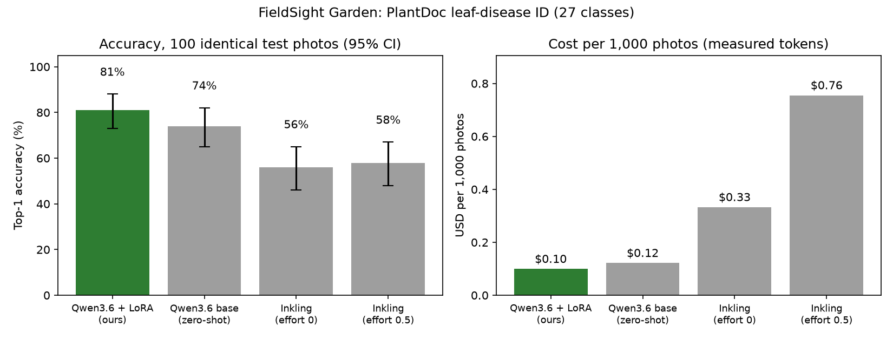

# FieldSight Garden: results

*Tue Oct 6, 2026, ET. Task: one leaf photo → plant + disease, 27 PlantDoc classes. Test set: fixed stratified 300 images, never used for training or checkpoint choice.*

## Headline
**The fine-tuned Qwen3.6-35B-A3B (LoRA rank 32, $1.47 of training) is the most accurate model tested *and* the cheapest:**
- **79.7%** top-1 accuracy, 95% CI [75.0, 84.0].
- That is **+12.0 points over its own untuned base** (paired 95% CI [+7.0, +17.0]).
- It is **+30.0 points over zero-shot Inkling** (paired CI [+23.7, +36.3]).
- Cost per 1,000 photos is **$0.10**, versus **$0.33 for Inkling** (3.4×) and **$0.76 for Inkling with thinking** (7.6×).
- Median latency is the same as the other models, about 2.4 s.

Inkling did *not* beat the fine-tuned model on accuracy in any setting we tried. So the story doesn't need the "comparable accuracy at lower cost" fallback: the small open model wins on accuracy and on cost, and ties on latency.



## Full test set (300 images)
| model | n | accuracy [95% CI] | macro-F1 | invalid | p50 latency | p95 latency | $ / 1k photos | cost vs FT |
|---|---|---|---|---|---|---|---|---|
| Qwen3.6-35B-A3B + LoRA (ours) | 300 | **79.7%** [75.0, 84.0] | 0.785 | 0.0% | 2.42 s | 3.38 s | $0.098 | 1.0× |
| Qwen3.6-35B-A3B base (zero-shot) | 300 | **67.7%** [62.3, 72.7] | 0.653 | 0.0% | 2.37 s | 3.53 s | $0.121 | 1.2× |
| Inkling (zero-shot, effort 0) | 300 | **49.7%** [44.0, 55.3] | 0.460 | 0.7% | 2.37 s | 3.55 s | $0.329 | 3.4× |

## Fixed 100-image subset (identical images for every model)
| model | n | accuracy [95% CI] | macro-F1 | invalid | p50 latency | p95 latency | $ / 1k photos | cost vs FT |
|---|---|---|---|---|---|---|---|---|
| Qwen3.6-35B-A3B + LoRA (ours) | 100 | **81.0%** [73.0, 88.0] | 0.786 | 0.0% | 2.42 s | 3.45 s | $0.099 | 1.0× |
| Qwen3.6-35B-A3B base (zero-shot) | 100 | **74.0%** [65.0, 82.0] | 0.713 | 0.0% | 2.36 s | 3.53 s | $0.122 | 1.2× |
| Inkling (zero-shot, effort 0) | 100 | **56.0%** [46.0, 65.0] | 0.503 | 0.0% | 2.39 s | 3.52 s | $0.333 | 3.4× |
| Inkling (zero-shot, effort 0.5) | 100 | **58.0%** [48.0, 67.0] | 0.516 | 0.0% | 3.35 s | 5.56 s | $0.755 | 7.6× |

## Paired accuracy difference vs fine-tuned (bootstrap 95% CI)
- full: Qwen3.6-35B-A3B base (zero-shot): FT minus model = +12.0 pts [+7.0, +17.0] (n=300)
- full: Inkling (zero-shot, effort 0): FT minus model = +30.0 pts [+23.7, +36.3] (n=300)
- subset100: Qwen3.6-35B-A3B base (zero-shot): FT minus model = +7.0 pts [+0.0, +14.0] (n=100)
- subset100: Inkling (zero-shot, effort 0): FT minus model = +25.0 pts [+15.0, +35.0] (n=100)
- subset100: Inkling (zero-shot, effort 0.5): FT minus model = +23.0 pts [+12.0, +34.0] (n=100)

Notes on the columns:
- **Accuracy:** lenient parsing, which accepts a class string inside a longer answer. Strict exact-match accuracy was identical for every model. The only unparseable outputs were 2 of Inkling's at effort 0 ("tomato rust", "lettuce downy mildew"), which count as wrong under both rules.
- **CI:** 10,000-sample bootstrap. For comparisons, use the **paired** CIs, because all models saw the same images.
- **$ / 1k photos:** measured prompt, cached and output tokens × models.json prices (Inkling at the current 50% promo).
  - Tinker's prefix cache reused the shared prompt prefix: about 44 cached prompt tokens per call for the fine-tuned model, 175 for base Qwen and 170 for Inkling. That cache mostly helps the zero-shot models, whose prompt carries the 27-class list.
  - Without any cache discount the figures are FT $0.12, base $0.20 and Inkling $0.58 per 1k. That is still a 4.8× Inkling multiple.
  - A $/1k-correct-answer column is in `report.json`: FT $0.12, base $0.18, Inkling $0.66.
- **Latency:** wall-clock time per request to Tinker's sampling API from this box, at 8 concurrent requests, temperature 0, single answer. Tinker describes its sampling service as throughput-oriented with variable latency. The thin serving client, called one request at a time, measured 2.7–2.9 s per photo. Latency is a **tie** between Qwen3.6 and Inkling at effort 0; Inkling at effort 0.5 is slower (p50 3.35 s, p95 5.56 s) because it writes about 90 thinking tokens on average.
- **Inkling settings:** effort 0 was run on all 300 test images; effort 0.5 on the fixed 100-image subset (`stratified_subsample(test, 100, seed=0)`). Thinking helped only slightly (56% → 58% on the subset) and more than doubled the cost.

## Training
- **Setup:** `Qwen/Qwen3.6-35B-A3B` with LoRA rank 32, LR 5e-4 on a cosine schedule, batch 32, 3 epochs = 192 steps, horizontal flips, renderer `qwen3_5_disable_thinking`. 1,247,739 training tokens.
- **Prompt:** "Plant and disease in this leaf photo? Answer with the class only." The target is the bare class string.
- **Val accuracy (150 images):**

| step | 0 (base, short prompt) | 32 | 64 | 96 | 128 | 160 | 192 (final) |
|---|---|---|---|---|---|---|---|
| val acc | 27.3% | 71.3% | 78.0% | 78.0% | 86.0% | 86.7% | 83.3% |

- **Train NLL:** 1.60 → 0.015 by the end. Some overfitting in epoch 3 is plausible, but the val difference between steps 128 and 192 is 4 images out of 150, well within noise.
- **Checkpoint choice:** we evaluated the pre-planned `final` checkpoint, which never expires, and did not pick a checkpoint by test score. Step 128 scored slightly higher on val but expires Oct 13.

## Confusion highlights (full test set; `eval-*/confusion_*.csv`)
- **Fine-tuned model:** its remaining errors are the pairs that are genuinely hard and noisy in PlantDoc:
  - septoria ↔ bacterial spot on tomato (6 + 5)
  - potato early → late blight (5)
  - corn gray leaf spot → leaf blight (4)
  - tomato early blight → potato early blight (4): the disease is right but the host is wrong
  - Weakest per-class F1: tomato bacterial spot 0.25, potato early blight 0.40, tomato early blight 0.40.
- **Biggest gains over base Qwen (per-class F1):**
  - tomato yellow leaf curl virus 0.17 → 0.80 (base called it mosaic virus 8 times)
  - tomato leaf mold 0.17 → 0.57
  - tomato mosaic virus 0.36 → 0.83
  - potato late blight 0.32 → 0.71
  - apple healthy 0.71 → 1.00
- **Small regressions vs base:** soybean healthy 0.93 → 0.82, grape black rot 1.00 → 0.94. Each is 1–2 images.
- **Inkling (effort 0):** its main failure is corn: corn leaf blight was called gray leaf spot 16 times and rust 5 times. It also over-predicts "tomato early blight" for many leaf-spot diseases, including bell pepper leaf spot.

## Honest caveats for the post
- PlantDoc labels are noisy. We removed 32 duplicate photos that carried conflicting labels, but more noise remains. The test set is small, so per-class numbers are anecdotal; quote the CIs.
- The zero-shot baselines saw the full class list in their prompt. The fine-tuned model saw only the short prompt; learning the label vocabulary is part of what fine-tuning buys.
- Base Qwen is a strong zero-shot baseline (67.7%). The +12-point gain is the clean measure of what LoRA added.
- Inkling was not prompt-tuned, apart from the two effort settings, and was not fine-tuned. "Zero-shot Inkling" is the comparison, not "best possible Inkling".
- Latency was measured over the internet against a shared beta service.

## Spend (estimated from token counts × models.json prices)
| item | $ |
|---|---|
| Cost probe | 0.004 |
| Smoke test (2 steps) | 0.016 |
| Training, 1,247,739 tokens × $1.177/M | 1.469 |
| In-training val evals (6 × 150) | ~0.10 |
| Eval: base + Inkling effort 0, 300 each | 0.135 |
| Eval: Inkling effort 0.5, 100 | 0.076 |
| Eval: FT on val + test | 0.045 |
| Serving-client check (10 images) + OpenAI-endpoint attempt (rejected) | ~0.002 |
| **Total compute** | **≈ $1.85** |
| Checkpoint storage | see below |

`tinker billing usage` for Oct 6 (UTC) still returned no rows when checked. The docs say usage data lags by up to a few hours. Re-run:
`tinker -f json billing usage 2026-10-06T00:00:00Z 2026-10-07T00:00:00Z`

**Storage warning:** this run's checkpoints total about 35.8 GB on Tinker, about $3.58/month at $0.10/GB-month:
- MoE LoRA sampler weights: 2.24 GB each
- Training state with optimizer: 6.71 GB each
- The periodic checkpoints (000064, 000128) expire Oct 13.
- The `final` checkpoints and both smoke-run checkpoints never expire.

Recommended cleanup, which needs Sam's OK because it deletes cloud data: keep only `sampler_weights/final` and delete the rest:
```
tinker checkpoint delete \
  tinker://888b4782-c975-59b1-8462-7957e034531b:train:0/sampler_weights/final \
  tinker://888b4782-c975-59b1-8462-7957e034531b:train:0/weights/final \
  tinker://f5090c0f-f54a-53c7-8aa7-e6486f065aef:train:0/weights/000064 \
  tinker://f5090c0f-f54a-53c7-8aa7-e6486f065aef:train:0/sampler_weights/000064 \
  tinker://f5090c0f-f54a-53c7-8aa7-e6486f065aef:train:0/weights/000128 \
  tinker://f5090c0f-f54a-53c7-8aa7-e6486f065aef:train:0/sampler_weights/000128
# optional (only needed to resume training): tinker://f5090c0f-...:train:0/weights/final
```
That brings ongoing storage down to about 2.24 GB (about $0.22/month), or about 8.95 GB if `weights/final` is kept.

## Serving
- **Model path for the app:** `tinker://f5090c0f-f54a-53c7-8aa7-e6486f065aef:train:0/sampler_weights/final`. It is LoRA rank 32 on `Qwen/Qwen3.6-35B-A3B`, never expires, and is private.
- **The OpenAI-compatible endpoint does not work for this app.** It accepts text chat, but returned HTTP 400 `"Image input is not supported for this model."` when given an image (tested Oct 6, `scripts/oai_smoke.py`).
- **Use the native Tinker SDK instead:** `serving/fieldsight_infer.py`.
  - It needs only `tinker` + `Pillow` (transformers comes in as a tinker dependency for the tokenizer). No torch and no cookbook, so it fits a small Render instance.
  - It rebuilds the training prompt token-for-token: checked on all 450 val + test images, 0 mismatches.
  - It returns `label`, the 3 fix steps, sources and a disclaimer.
  - Live check: it agreed with the eval harness on 10/10 val images, at 2.7–2.9 s per photo.
  - The model path can be overridden with the env var `FIELDSIGHT_MODEL_PATH`.
- **Downloaded adapter:** `adapters/f5090c0f-f54a-53c7-8aa7-e6486f065aef:train:0_sampler_weights_final/`, containing `adapter_model.safetensors` (2.2 GB) and `adapter_config.json`. It is a Tinker-format LoRA. For self-hosting, convert it with `tinker_cookbook.weights` (`build_lora_adapter` for PEFT/vLLM, or `build_hf_model` to merge). Not attempted.

## Reproduce
```bash
source .venv/bin/activate
python scripts/train.py log_dir=runs/ft-qwen36-r32
python scripts/eval.py --models base,inkling --inkling-n 0                 # -> results/eval-test-base_and_inkling-e0
python scripts/eval.py --models inkling --inkling-n 100 --inkling-effort 0.5 --inkling-max-tokens 1024
python scripts/eval.py --models ft --ft-path tinker://f5090c0f-f54a-53c7-8aa7-e6486f065aef:train:0/sampler_weights/final --inkling-n 0
python scripts/report.py --ft ft_qwen --items ft_qwen=results/eval-test-ft-final/items_ft_qwen.jsonl \
  base_qwen_zs=results/eval-test-base_and_inkling-e0/items_base_qwen_zs.jsonl \
  inkling_e0=results/eval-test-base_and_inkling-e0/items_inkling_zs_effort0.0.jsonl \
  inkling_e05=results/eval-test-inkling-e0.5-n100/items_inkling_zs_effort0.5.jsonl
```
